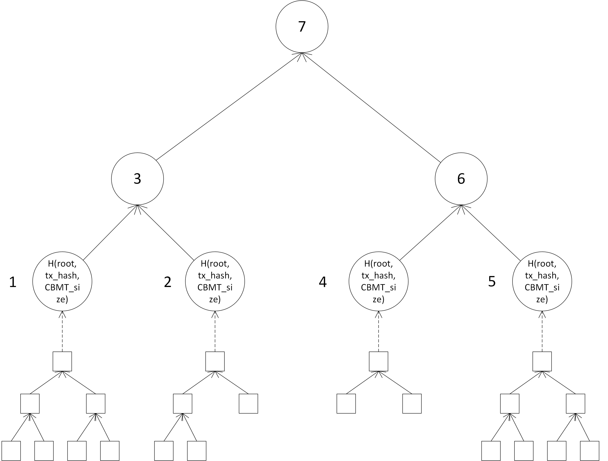
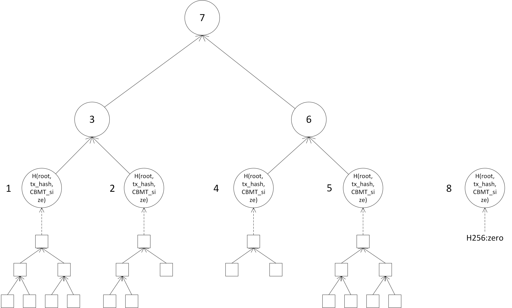
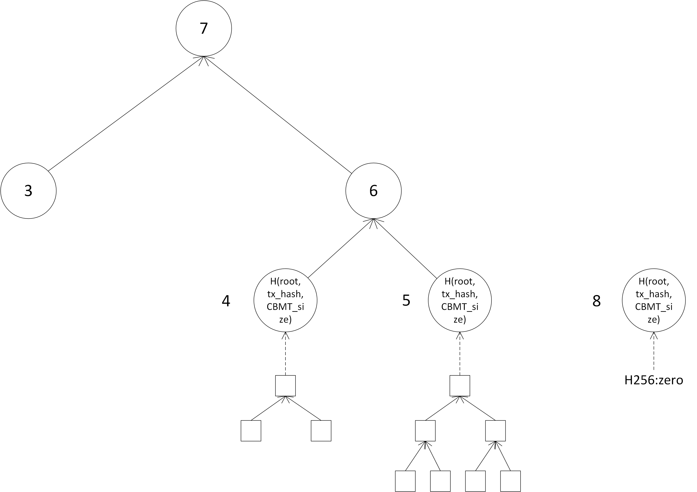
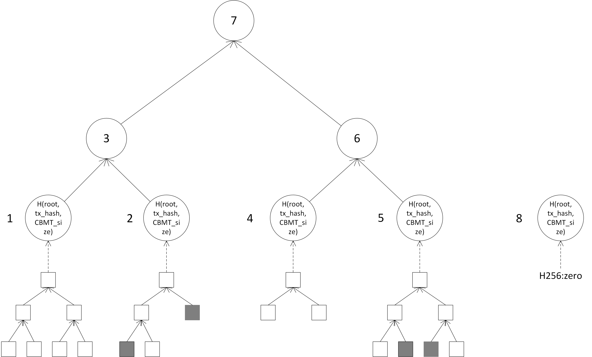

# Transaction Output Commitments using MMR

## Motivation

"A merkle tree committing to the state of all transaction outputs, both spent and unspent, can provide a method of compactly proving the current state of an output. This lets us 'archive' less frequently accessed parts of the UTXO set, allowing full nodes to discard the associated data, still providing a mechanism to spend those archived outputs by proving to those nodes that the outputs are in fact unspent." So, with transaction output(TXO) commitments, the size of TXO set can be limited, and the TXO set can be synchronized faster.

## MMR

Merkle Mountain Range(MMR) is first introduced by [Peter Todd][1], it is "a type of deterministic, indexable, insertion ordered merkle tree, which allows new items to be cheaply appended to the tree with minimal storage requirements". "Once an output is added to the TXO MMR it is never removed; if an output is spent its status is updated in place." "Both the state of a specific item in the MMR, as well the validity of changes to items in the MMR, can be proven with logn sized proofs consisting of a merkle path to the tip of the tree."

## TXO Commitments using MMR

TXO Commitments using MMR is posed by [Perter Todd][2], this rfc is mostly same with Perter's design. But there are still some difference in detail.

### Structure

The key of output consist of a transaction hash and an index, so we can't organize the output into a MMR directly. The outputs inner a transaction are built into a CBMT(rfc#0006) and this subtrees are organized into a MMR. The leaf of MMR is the hash of CBMT's root, transaction hash and CBMT size.

Suppose we have 2 transactions, the first transaction have 4 outputs and second have 3 outputs, the MMR would be:


And we add a transaction with 2 outputs, the MMR would be:


Then add a transaction with 4 outputs, the MMR would be:



Then add a transaction with 0 outputs, the MMR would be:



Specially, if MMR is empty, the root of MMR is `H256::zero`.

### Spending

If we want spend an output, we just mark the corresponding node as `H256::zero` and recalculate the peaks.

### Pruning

The MMR can be pruned if there are more than **n** transactions(all the outputs in one transaction is combined into a leaf node) in it. The old transaction is always pruned first. In order to update MMR correctly, if a node is still in the MMR, its sibling should not be pruned.

If **n=3**, the MMR above would be:



### Delayed Commitments

A meta is added into the block header called outputs_root, it is the root of MMR.

When a fork happen, it may cost a lot of work on MMR's rollback. In order to avoid this, we delay the commitments **m** blocks, which means the block **i** commits to the TXO set state as of block **i-m**, in other words the outputs_root in block **i** is the root of MMR up until block **i-m**. So the STXOs and UTXOs of latest **m** blocks should be cached.

### Proof

For the sake of illustration, we define **Breadth Order** is that from ***top to bottom*** and ***left to right***.

If an output is pruned, the miner should attach a proof on the block to prove that this output is still unspent. The structure of proof is:

```
table MMRProof {
    output_proofs: [CBMTProof],
    nodes: [H256],
    left_peaks: [H256],
}
```

`CBMTProof` is defined in RFC#0006, it is used for proving that certain outputs inner a transaction is still unspent. The proof in `output_proofs` is in **descending breadth order** by the node it proved for. The `nodes` is a list of siblings of the nodes along the path that form leaves to peaks, excluding the nodes already in the path, they are also in **descending breadth order**. The `left_peaks` is a list of peaks that can't be calculated directly. The right most peaks should be combined. Also, the peaks are in **descending breadth order**.

If we want to prove the gray nodes in below figure are unspent, the `nodes` in MMRProof would be `[Node4, Node1]` and the `left_peaks` would be `[Node8]`.



The proofs are attached to the block body with outputs, this can be done by miner or node server. The structure is:

```
table OutputWithIndex {
    output: OutPut,
    index: uint32,
}

table OutputsInnerTx {
    outputs: [OutputWithIndex],
    index: uint64,
}

table OutputsWithProof {
    outputs: [OutputsInnerTx]
    Proof: MMRProof,
}
```

## Reference

[1]: [Merkle Mountain Ranges](https://github.com/opentimestamps/opentimestamps-server/blob/master/doc/merkle-mountain-range.md), Peter Todd, OpenTimestamps, Mar 18th 2013.

[2]: [Making UTXO Set Growth Irrelevant With Low-Latency Delayed TXO Commitments](https://petertodd.org/2016/delayed-txo-commitments), Peter Todd, May 17th 2016.